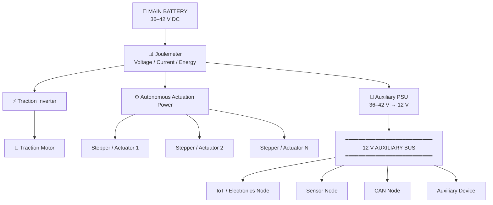
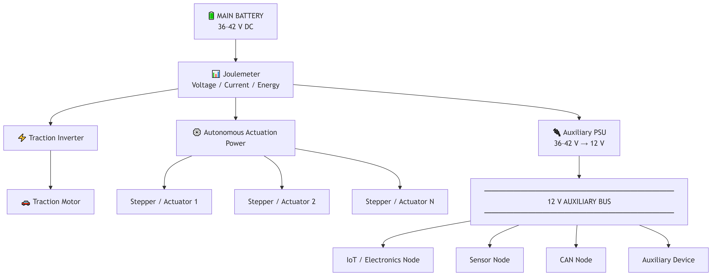
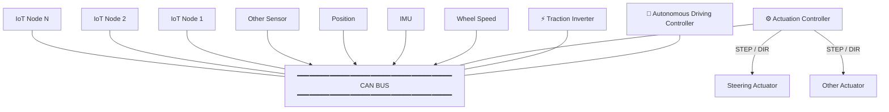
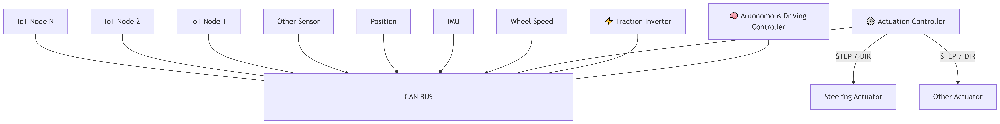

# ProtoEV Electrical & Communication Architecture

[TOC]

## 1. System Overview

The ProtoEV electrical system is designed around a centralized high-voltage energy source with distributed power conversion, actuation, sensing, and vehicle-control subsystems.

The main battery provides the primary electrical energy for the vehicle. Battery power is distributed directly to the traction inverter and the autonomous-driving actuation system, while a dedicated auxiliary power supply converts the battery voltage to a regulated low-voltage auxiliary bus for the vehicle's electronic systems.

The architecture is intentionally modular, allowing individual subsystems to be developed, tested, and replaced independently while maintaining a clearly defined electrical and communication interface between them.

The system can be divided into two major domains:

* **Electrical architecture:** energy generation, measurement, conversion, and distribution.
* **Communication architecture:** exchange of commands, measurements, diagnostics, and sensor data between vehicle controllers and distributed nodes.

This separation allows the electrical power path and the vehicle communication network to evolve independently as the ProtoEV platform develops.

---

## 2. Electrical Architecture

The ProtoEV is powered by a nominal 36 V-class battery system, with the battery voltage reaching approximately 42 V at full charge.

A dedicated joulemeter / energy meter is positioned directly downstream of the main battery. This provides a common measurement point for the electrical energy supplied to the vehicle and enables monitoring of battery voltage, current, power, and accumulated energy consumption.

From the energy-measurement point, the main battery supply is distributed to the vehicle's high-power subsystems.

The **traction inverter** receives the main battery voltage and drives the traction motor. The inverter is responsible for converting the battery's DC energy into the controlled electrical waveforms required by the traction motor.

The battery also supplies the **autonomous-driving actuation system**, which provides the electrical power required by steering, braking, and other electromechanical actuators used by the vehicle.

A separate **auxiliary power supply (PSU)** converts the battery voltage into a regulated 12 V auxiliary supply. This supply feeds a distributed auxiliary power bus serving the vehicle's electronic systems, including ECUs, sensors, communication nodes, IoT devices, and other low-power electronics.

The auxiliary bus provides a common power-distribution infrastructure while allowing individual nodes to remain electrically modular.

### Electrical Design Philosophy

The electrical architecture prioritizes:

* **Clear power-domain separation** between traction, actuation, and low-voltage electronics.
* **Centralized energy measurement** for vehicle-level energy monitoring.
* **Modularity**, allowing individual electronic nodes to be added or removed without redesigning the complete vehicle electrical system.
* **Serviceability**, with clearly defined interfaces between power conversion and downstream loads.
* **Efficiency**, which is particularly important for an energy-constrained competition vehicle.
* **Scalability**, allowing additional sensors, controllers, and electronic nodes to be incorporated as the vehicle's autonomous-driving capabilities develop.

---

## 3. Communication Architecture

The communication architecture provides the digital infrastructure connecting the vehicle's controllers, traction system, autonomous-driving system, sensors, and distributed electronic nodes.

A vehicle-level communication network is used to exchange control commands, sensor measurements, operating states, diagnostics, and other real-time information between subsystems.

The architecture is centered around distributed controllers rather than a single monolithic control unit. This allows computational and functional responsibilities to be separated between the autonomous-driving controller, vehicle control logic, traction inverter, actuation controllers, and sensor nodes.

CAN is used as a principal vehicle communication interface because of its robustness, multi-node architecture, error detection, and suitability for distributed automotive electronics.

Other interfaces such as UART, SPI, I²C, or dedicated digital interfaces may be used locally where appropriate. These interfaces are treated as subsystem-level connections rather than replacing the vehicle-level communication network.

### Communication Design Philosophy

The communication system is designed around the following principles:

* **Distributed intelligence:** individual nodes perform dedicated sensing, control, or actuation functions.
* **Deterministic communication:** time-critical vehicle information is exchanged using appropriate real-time communication mechanisms.
* **Fault isolation:** failure of a non-critical node should not unnecessarily compromise unrelated vehicle functions.
* **Diagnostics:** communication interfaces provide opportunities for subsystem monitoring, fault reporting, and debugging.
* **Modularity:** nodes can be developed independently while conforming to common communication interfaces.
* **Scalability:** additional sensors and electronic control nodes can be integrated without fundamentally changing the vehicle architecture.

---

## 4. System-Level Integration

The electrical and communication architectures are intentionally coupled at the system level while remaining independently structured.

Electrical power is distributed through dedicated power paths, while information is distributed through the vehicle communication network. Each electronic node therefore has two fundamental interfaces with the vehicle:

1. **Power interface** — supplied through the auxiliary power distribution system.
2. **Communication interface** — used to exchange information with other vehicle subsystems.

This approach allows the vehicle to be treated as a modular distributed embedded system rather than as a collection of independent electronic boards.

For development and testing, individual nodes can be validated independently before integration into the complete vehicle. This also enables the team to reuse the same electronics architecture across future ProtoEV iterations.

---

## 5. Development Platform and Semiconductor Ecosystem

The ProtoEV architecture is intended to serve not only as a competition vehicle but also as a development platform for advanced embedded control, motor control, power electronics, sensing, and automotive communication.

The system provides several areas where modern microcontrollers, power-management ICs, gate drivers, sensors, and communication devices can be integrated into a coherent vehicle platform.

Potential semiconductor technologies include:

* Microcontrollers for distributed control and autonomous-driving subsystems.
* Motor-control MCUs for traction and actuator control.
* CAN and other automotive communication interfaces.
* Power-management and DC/DC conversion devices.
* Gate drivers and power semiconductors for traction and actuator inverters.
* Current, voltage, and environmental sensing.
* Low-power MCUs for distributed sensor and IoT nodes.

The architecture is therefore designed to provide a practical platform for evaluating semiconductor technologies under real vehicle operating conditions while maintaining a clear separation between subsystem responsibilities.

---

## 6. Engineering Objectives

The overall electrical and communication architecture is intended to achieve four primary objectives:

**Efficiency** — minimize electrical losses and unnecessary energy consumption, which directly contributes to vehicle efficiency during competition.

**Reliability** — provide predictable electrical and communication behavior under the electrical and mechanical conditions experienced by the vehicle.

**Modularity** — allow individual hardware and firmware subsystems to be developed independently and integrated through well-defined interfaces.

**Development Value** — create an architecture that is useful beyond a single competition vehicle, providing the team with a reusable platform for future electric and autonomous vehicle development.

The resulting system combines a centralized energy source with distributed embedded intelligence, creating a compact vehicle electrical architecture suitable for both energy-efficient competition and continued research and development.

## ST & Team Collaboration

The ProtoEV project presents an opportunity for collaboration between the team and STMicroelectronics in the development of an energy-efficient electric and autonomous vehicle platform.

The team is interested in exploring the integration of STMicroelectronics technologies across relevant areas of the vehicle, including embedded control, motor control, power electronics, sensing, connectivity, and power management.

A potential collaboration could include:

* **Technical collaboration** — evaluation and integration of relevant STMicroelectronics devices within the vehicle's electrical and electronic subsystems.
* **Engineering support** — access to technical resources, documentation, development tools, and application expertise where appropriate.
* **Component sponsorship** — provision of selected components, development boards, evaluation hardware, or other resources required for vehicle development.
* **Knowledge exchange** — opportunities for the team to gain practical experience with STMicroelectronics technologies while providing feedback from real-world student vehicle development.
* **Project visibility** — recognition of STMicroelectronics as a technology partner through appropriate team communications, project documentation, events, competitions, and media activities.

The team would be happy to define the scope of collaboration according to STMicroelectronics' interests and available resources, with the objective of establishing a mutually beneficial engineering partnership around the ProtoEV project.
